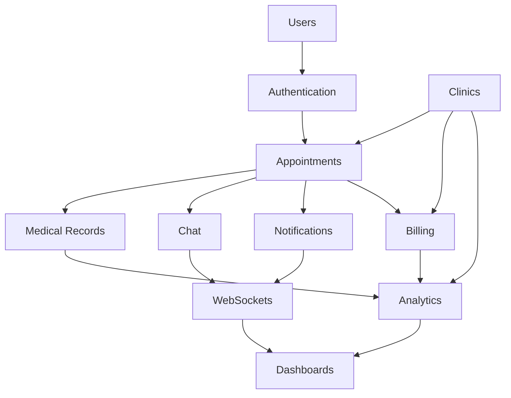

# 🔗 INTEGRATION GUIDE - MediConnect

## 📋 **RESUMEN DEL MÓDULO**

Guía completa de integración que explica cómo los diferentes módulos del sistema MediConnect trabajan juntos para proporcionar una experiencia cohesiva de gestión de clínicas médicas.

---

## 🏗️ **ARQUITECTURA DE INTEGRACIÓN**

### **Flujo de Datos Principal**



### **Dependencias entre Módulos**

| **Módulo**          | **Depende de**               | **Usado por**                                 |
| ------------------- | ---------------------------- | --------------------------------------------- |
| **Users**           | Core                         | Todos los módulos                             |
| **Authentication**  | Users                        | Todos los módulos                             |
| **Clinics**         | Users                        | Appointments, Billing, Analytics              |
| **Appointments**    | Users, Clinics               | Medical Records, Chat, Billing, Notifications |
| **Medical Records** | Users, Appointments          | Analytics                                     |
| **Chat**            | Users, Appointments          | WebSockets, Notifications                     |
| **Notifications**   | Users, Appointments          | WebSockets                                    |
| **Billing**         | Users, Appointments, Clinics | Analytics                                     |
| **Analytics**       | Todos los módulos            | Dashboards                                    |
| **WebSockets**      | Chat, Notifications          | Frontend                                      |
| **Dashboards**      | Analytics, WebSockets        | Frontend                                      |

---

## 🔄 **FLUJOS DE TRABAJO PRINCIPALES**

### **1. Flujo de Registro y Primera Cita**

```typescript
// 1. Registro de usuario
const registerUser = async (userData: RegisterData) => {
  // POST /api/auth/register/
  const response = await api.post("/auth/register/", userData);
  return response.data;
};

// 2. Login y obtención de token
const login = async (credentials: LoginData) => {
  // POST /api/auth/login/
  const response = await api.post("/auth/login/", credentials);
  localStorage.setItem("access_token", response.data.access);
  return response.data;
};

// 3. Búsqueda de clínicas disponibles
const getClinics = async () => {
  // GET /api/clinics/
  const response = await api.get("/clinics/", {
    headers: { Authorization: `Bearer ${token}` },
  });
  return response.data;
};

// 4. Búsqueda de doctores en clínica
const getDoctors = async (clinicId: string) => {
  // GET /api/clinics/{id}/doctors/
  const response = await api.get(`/clinics/${clinicId}/doctors/`);
  return response.data;
};

// 5. Verificar disponibilidad de citas
const getAvailableSlots = async (doctorId: string, date: string) => {
  // GET /api/appointments/available-slots/
  const response = await api.get("/appointments/available-slots/", {
    params: { doctor: doctorId, date },
  });
  return response.data;
};

// 6. Crear cita
const createAppointment = async (appointmentData: AppointmentData) => {
  // POST /api/appointments/
  const response = await api.post("/appointments/", appointmentData);

  // Esto automáticamente triggerea:
  // - Notificación al doctor (Notifications module)
  // - Entrada en Analytics (Analytics module)
  // - Preparación para billing (Billing module)

  return response.data;
};
```

### **2. Flujo de Consulta Médica Completa**

```typescript
// 1. Doctor ve sus citas del día
const getDoctorAppointments = async (date: string) => {
  // GET /api/appointments/?doctor=current&date=today
  const response = await api.get("/appointments/", {
    params: { doctor: "current", date },
  });
  return response.data;
};

// 2. Iniciar chat con paciente
const startConsultationChat = async (appointmentId: string) => {
  // Establecer conexión WebSocket
  const socket = new WebSocket(`ws://localhost:8000/ws/chat/${appointmentId}/`);

  socket.onopen = () => {
    console.log("Chat connected");
  };

  socket.onmessage = (event) => {
    const data = JSON.parse(event.data);
    // Manejar mensajes del chat
  };

  return socket;
};

// 3. Crear historial médico durante la consulta
const createMedicalRecord = async (recordData: MedicalRecordData) => {
  // POST /api/medical-records/
  const response = await api.post("/medical-records/", recordData);
  return response.data;
};

// 4. Agregar medicamentos y prescripciones
const addMedication = async (medicationData: MedicationData) => {
  // POST /api/medical-records/medications/
  const response = await api.post(
    "/medical-records/medications/",
    medicationData
  );
  return response.data;
};

// 5. Completar cita y generar factura
const completeAppointment = async (
  appointmentId: string,
  consultationData: any
) => {
  // PATCH /api/appointments/{id}/
  const appointmentResponse = await api.patch(
    `/appointments/${appointmentId}/`,
    {
      status: "completed",
      notes: consultationData.notes,
    }
  );

  // POST /api/billing/invoices/
  const invoiceResponse = await api.post("/billing/invoices/", {
    appointment: appointmentId,
    items: consultationData.billingItems,
  });

  return {
    appointment: appointmentResponse.data,
    invoice: invoiceResponse.data,
  };
};
```

### **3. Flujo de Notificaciones en Tiempo Real**

```typescript
// 1. Configurar conexión de notificaciones
const setupNotifications = (userId: string) => {
  const notificationSocket = new WebSocket(
    `ws://localhost:8000/ws/notifications/${userId}/`
  );

  notificationSocket.onmessage = (event) => {
    const notification = JSON.parse(event.data);

    switch (notification.type) {
      case "appointment_reminder":
        showAppointmentReminder(notification.data);
        break;
      case "new_message":
        showNewMessage(notification.data);
        break;
      case "appointment_cancelled":
        showAppointmentCancellation(notification.data);
        break;
      case "invoice_generated":
        showInvoiceNotification(notification.data);
        break;
    }
  };

  return notificationSocket;
};

// 2. Enviar notificación manual
const sendNotification = async (notificationData: NotificationData) => {
  // POST /api/notifications/
  const response = await api.post("/notifications/", notificationData);
  return response.data;
};
```

---

## 🎯 **CASOS DE USO INTEGRADOS**

### **Caso 1: Dashboard del Doctor**

```typescript
// Componente React que integra múltiples módulos
const DoctorDashboard: React.FC = () => {
  const [dashboardData, setDashboardData] = useState(null);
  const [appointments, setAppointments] = useState([]);
  const [messages, setMessages] = useState([]);
  const [notifications, setNotifications] = useState([]);

  useEffect(() => {
    const loadDashboardData = async () => {
      // 1. Cargar datos del dashboard (Analytics module)
      const dashboard = await api.get("/dashboard/doctor/");
      setDashboardData(dashboard.data);

      // 2. Cargar citas del día (Appointments module)
      const todayAppointments = await api.get("/appointments/", {
        params: { date: "today", doctor: "current" },
      });
      setAppointments(todayAppointments.data.results);

      // 3. Cargar mensajes recientes (Chat module)
      const recentMessages = await api.get("/chat/messages/", {
        params: { limit: 5 },
      });
      setMessages(recentMessages.data.results);

      // 4. Cargar notificaciones (Notifications module)
      const recentNotifications = await api.get("/notifications/", {
        params: { unread: true },
      });
      setNotifications(recentNotifications.data.results);
    };

    loadDashboardData();

    // 5. Configurar WebSocket para actualizaciones en tiempo real
    const wsSocket = setupNotifications(currentUser.id);

    return () => {
      wsSocket.close();
    };
  }, []);

  return (
    <div className="doctor-dashboard">
      {/* Métricas del día */}
      <MetricsCards data={dashboardData?.metrics} />

      {/* Citas de hoy */}
      <AppointmentsList appointments={appointments} />

      {/* Mensajes recientes */}
      <MessagesList messages={messages} />

      {/* Notificaciones */}
      <NotificationsList notifications={notifications} />
    </div>
  );
};
```

### **Caso 2: Sistema de Billing Integrado**

```typescript
// Proceso completo de facturación
const processBilling = async (appointmentId: string) => {
  // 1. Obtener datos de la cita (Appointments module)
  const appointment = await api.get(`/appointments/${appointmentId}/`);

  // 2. Obtener información del paciente (Users module)
  const patient = await api.get(`/users/patients/${appointment.data.patient}/`);

  // 3. Obtener configuración de la clínica (Clinics module)
  const clinic = await api.get(`/clinics/${appointment.data.clinic}/`);

  // 4. Obtener servicios realizados (Medical Records module)
  const medicalRecord = await api.get("/medical-records/", {
    params: { appointment: appointmentId },
  });

  // 5. Calcular costos
  const billingItems = [
    {
      description: "Consulta médica",
      quantity: 1,
      unit_price: appointment.data.doctor.consultation_fee,
      total: appointment.data.doctor.consultation_fee,
    },
  ];

  // Agregar medicamentos si los hay
  if (medicalRecord.data.medications?.length > 0) {
    medicalRecord.data.medications.forEach((med) => {
      billingItems.push({
        description: `Medicamento: ${med.name}`,
        quantity: med.quantity,
        unit_price: med.price,
        total: med.quantity * med.price,
      });
    });
  }

  // 6. Crear factura (Billing module)
  const invoice = await api.post("/billing/invoices/", {
    patient: patient.data.id,
    doctor: appointment.data.doctor.id,
    clinic: clinic.data.id,
    appointment: appointmentId,
    items: billingItems,
    subtotal: billingItems.reduce((sum, item) => sum + item.total, 0),
    tax_rate: clinic.data.settings.tax_rate,
    due_date: new Date(Date.now() + 30 * 24 * 60 * 60 * 1000), // 30 días
  });

  // 7. Enviar notificación al paciente (Notifications module)
  await api.post("/notifications/", {
    recipient: patient.data.user.id,
    type: "invoice_generated",
    title: "Nueva factura generada",
    message: `Se ha generado una factura por $${invoice.data.total_amount}`,
    data: { invoice_id: invoice.data.id },
  });

  return invoice.data;
};
```

### **Caso 3: Analytics en Tiempo Real**

```typescript
// Componente para métricas en tiempo real
const RealTimeAnalytics: React.FC = () => {
  const [metrics, setMetrics] = useState({});
  const [realtimeData, setRealtimeData] = useState({});

  useEffect(() => {
    // 1. Cargar métricas iniciales (Analytics module)
    const loadMetrics = async () => {
      const response = await api.get("/analytics/operational-metrics/", {
        params: { period: "today" },
      });
      setMetrics(response.data);
    };

    loadMetrics();

    // 2. Configurar WebSocket para actualizaciones en tiempo real
    const metricsSocket = new WebSocket("ws://localhost:8000/ws/analytics/");

    metricsSocket.onmessage = (event) => {
      const data = JSON.parse(event.data);

      // Actualizar métricas en tiempo real basadas en eventos
      switch (data.event_type) {
        case "appointment_created":
          setRealtimeData((prev) => ({
            ...prev,
            appointments_today: prev.appointments_today + 1,
            revenue_projected: prev.revenue_projected + data.appointment_fee,
          }));
          break;

        case "appointment_completed":
          setRealtimeData((prev) => ({
            ...prev,
            appointments_completed: prev.appointments_completed + 1,
            revenue_actual: prev.revenue_actual + data.invoice_amount,
          }));
          break;

        case "patient_registered":
          setRealtimeData((prev) => ({
            ...prev,
            new_patients_today: prev.new_patients_today + 1,
          }));
          break;
      }
    };

    return () => metricsSocket.close();
  }, []);

  return (
    <div className="realtime-analytics">
      <div className="metrics-grid">
        <MetricCard
          title="Citas de Hoy"
          value={
            metrics.appointments_today + (realtimeData.appointments_today || 0)
          }
        />
        <MetricCard
          title="Ingresos del Día"
          value={`$${
            metrics.daily_revenue + (realtimeData.revenue_actual || 0)
          }`}
        />
        <MetricCard
          title="Nuevos Pacientes"
          value={metrics.new_patients + (realtimeData.new_patients_today || 0)}
        />
      </div>
    </div>
  );
};
```

---

## 🔐 **INTEGRACIÓN DE AUTENTICACIÓN**

### **Interceptor de API con JWT**

```typescript
// Configuración de Axios con interceptores
import axios from "axios";

const api = axios.create({
  baseURL: process.env.REACT_APP_API_URL || "http://localhost:8000/api",
});

// Request interceptor para agregar token
api.interceptors.request.use(
  (config) => {
    const token = localStorage.getItem("access_token");
    if (token) {
      config.headers.Authorization = `Bearer ${token}`;
    }
    return config;
  },
  (error) => Promise.reject(error)
);

// Response interceptor para manejar refresh token
api.interceptors.response.use(
  (response) => response,
  async (error) => {
    const originalRequest = error.config;

    if (error.response?.status === 401 && !originalRequest._retry) {
      originalRequest._retry = true;

      try {
        const refreshToken = localStorage.getItem("refresh_token");
        const response = await axios.post("/auth/refresh/", {
          refresh: refreshToken,
        });

        const newAccessToken = response.data.access;
        localStorage.setItem("access_token", newAccessToken);

        // Reintentar request original
        originalRequest.headers.Authorization = `Bearer ${newAccessToken}`;
        return api(originalRequest);
      } catch (refreshError) {
        // Refresh token inválido, redirectar a login
        localStorage.removeItem("access_token");
        localStorage.removeItem("refresh_token");
        window.location.href = "/login";
      }
    }

    return Promise.reject(error);
  }
);

export default api;
```

### **Context de Autenticación**

```typescript
// AuthContext.tsx
import React, { createContext, useContext, useEffect, useState } from "react";

interface AuthContextType {
  user: User | null;
  login: (credentials: LoginData) => Promise<void>;
  logout: () => void;
  isAuthenticated: boolean;
  permissions: string[];
}

const AuthContext = createContext<AuthContextType | undefined>(undefined);

export const AuthProvider: React.FC<{ children: React.ReactNode }> = ({
  children,
}) => {
  const [user, setUser] = useState<User | null>(null);
  const [permissions, setPermissions] = useState<string[]>([]);

  useEffect(() => {
    const token = localStorage.getItem("access_token");
    if (token) {
      // Verificar y cargar usuario actual
      loadCurrentUser();
    }
  }, []);

  const loadCurrentUser = async () => {
    try {
      const response = await api.get("/auth/user/");
      setUser(response.data);

      // Cargar permisos basados en rol
      const permsResponse = await api.get("/auth/permissions/");
      setPermissions(permsResponse.data.permissions);
    } catch (error) {
      localStorage.removeItem("access_token");
      localStorage.removeItem("refresh_token");
    }
  };

  const login = async (credentials: LoginData) => {
    const response = await api.post("/auth/login/", credentials);

    localStorage.setItem("access_token", response.data.access);
    localStorage.setItem("refresh_token", response.data.refresh);

    setUser(response.data.user);
    setPermissions(response.data.permissions);
  };

  const logout = () => {
    localStorage.removeItem("access_token");
    localStorage.removeItem("refresh_token");
    setUser(null);
    setPermissions([]);
  };

  return (
    <AuthContext.Provider
      value={{
        user,
        login,
        logout,
        isAuthenticated: !!user,
        permissions,
      }}
    >
      {children}
    </AuthContext.Provider>
  );
};

export const useAuth = () => {
  const context = useContext(AuthContext);
  if (!context) {
    throw new Error("useAuth must be used within AuthProvider");
  }
  return context;
};
```

---

## 🌐 **INTEGRACIÓN DE WEBSOCKETS**

### **WebSocket Manager**

```typescript
// WebSocketManager.ts
class WebSocketManager {
  private connections: Map<string, WebSocket> = new Map();
  private reconnectAttempts: Map<string, number> = new Map();
  private maxReconnectAttempts = 5;

  connect(endpoint: string, onMessage: (data: any) => void) {
    const token = localStorage.getItem("access_token");
    const wsUrl = `ws://localhost:8000/ws/${endpoint}/?token=${token}`;

    const ws = new WebSocket(wsUrl);

    ws.onopen = () => {
      console.log(`WebSocket connected: ${endpoint}`);
      this.reconnectAttempts.set(endpoint, 0);
    };

    ws.onmessage = (event) => {
      const data = JSON.parse(event.data);
      onMessage(data);
    };

    ws.onclose = () => {
      console.log(`WebSocket disconnected: ${endpoint}`);
      this.handleReconnect(endpoint, onMessage);
    };

    ws.onerror = (error) => {
      console.error(`WebSocket error: ${endpoint}`, error);
    };

    this.connections.set(endpoint, ws);
    return ws;
  }

  private handleReconnect(endpoint: string, onMessage: (data: any) => void) {
    const attempts = this.reconnectAttempts.get(endpoint) || 0;

    if (attempts < this.maxReconnectAttempts) {
      const delay = Math.pow(2, attempts) * 1000; // Exponential backoff

      setTimeout(() => {
        this.reconnectAttempts.set(endpoint, attempts + 1);
        this.connect(endpoint, onMessage);
      }, delay);
    }
  }

  disconnect(endpoint: string) {
    const ws = this.connections.get(endpoint);
    if (ws) {
      ws.close();
      this.connections.delete(endpoint);
      this.reconnectAttempts.delete(endpoint);
    }
  }

  disconnectAll() {
    this.connections.forEach((ws, endpoint) => {
      this.disconnect(endpoint);
    });
  }
}

export const wsManager = new WebSocketManager();
```

### **Hook para Chat en Tiempo Real**

```typescript
// useChatSocket.ts
import { useEffect, useState } from "react";
import { wsManager } from "./WebSocketManager";

export const useChatSocket = (conversationId: string) => {
  const [messages, setMessages] = useState<Message[]>([]);
  const [isConnected, setIsConnected] = useState(false);

  useEffect(() => {
    const handleMessage = (data: any) => {
      switch (data.type) {
        case "chat_message":
          setMessages((prev) => [...prev, data.message]);
          break;
        case "typing_indicator":
          // Manejar indicador de escritura
          break;
        case "user_joined":
          setIsConnected(true);
          break;
        case "user_left":
          setIsConnected(false);
          break;
      }
    };

    const ws = wsManager.connect(`chat/${conversationId}`, handleMessage);

    return () => {
      wsManager.disconnect(`chat/${conversationId}`);
    };
  }, [conversationId]);

  const sendMessage = (content: string, messageType: string = "text") => {
    const ws = wsManager.connections.get(`chat/${conversationId}`);
    if (ws && ws.readyState === WebSocket.OPEN) {
      ws.send(
        JSON.stringify({
          type: "chat_message",
          content,
          message_type: messageType,
        })
      );
    }
  };

  const sendTypingIndicator = () => {
    const ws = wsManager.connections.get(`chat/${conversationId}`);
    if (ws && ws.readyState === WebSocket.OPEN) {
      ws.send(
        JSON.stringify({
          type: "typing_indicator",
        })
      );
    }
  };

  return {
    messages,
    isConnected,
    sendMessage,
    sendTypingIndicator,
  };
};
```

---

## 📊 **INTEGRATION TESTING**

### **Test de Integración de Módulos**

```python
# tests/integration/test_appointment_flow.py
from django.test import TestCase, TransactionTestCase
from channels.testing import WebsocketCommunicator
from rest_framework.test import APIClient
from django.contrib.auth import get_user_model

class AppointmentFlowIntegrationTest(TransactionTestCase):
    def setUp(self):
        self.client = APIClient()
        self.user = get_user_model().objects.create_user(
            email='patient@test.com',
            password='testpass',
            user_type='patient'
        )
        self.doctor_user = get_user_model().objects.create_user(
            email='doctor@test.com',
            password='testpass',
            user_type='doctor'
        )

    def test_complete_appointment_flow(self):
        """Test completo del flujo de citas que integra múltiples módulos."""

        # 1. Autenticación (Users + Authentication modules)
        login_response = self.client.post('/api/auth/login/', {
            'email': 'patient@test.com',
            'password': 'testpass'
        })
        self.assertEqual(login_response.status_code, 200)
        token = login_response.data['access']

        # 2. Configurar headers de autenticación
        self.client.credentials(HTTP_AUTHORIZATION=f'Bearer {token}')

        # 3. Crear cita (Appointments module)
        appointment_data = {
            'doctor': self.doctor_user.doctor.id,
            'datetime': '2024-01-15T10:00:00Z',
            'reason': 'Consulta general'
        }
        appointment_response = self.client.post('/api/appointments/', appointment_data)
        self.assertEqual(appointment_response.status_code, 201)
        appointment_id = appointment_response.data['id']

        # 4. Verificar que se creó notificación (Notifications module)
        notifications_response = self.client.get('/api/notifications/')
        self.assertTrue(any(
            n['type'] == 'appointment_created'
            for n in notifications_response.data['results']
        ))

        # 5. Completar cita y crear registro médico (Medical Records module)
        medical_record_data = {
            'patient': self.user.patient.id,
            'appointment': appointment_id,
            'symptoms': 'Dolor de cabeza',
            'diagnosis': 'Cefalea tensional',
            'treatment': 'Descanso y analgésicos'
        }
        record_response = self.client.post('/api/medical-records/', medical_record_data)
        self.assertEqual(record_response.status_code, 201)

        # 6. Generar factura (Billing module)
        invoice_data = {
            'patient': self.user.patient.id,
            'doctor': self.doctor_user.doctor.id,
            'appointment': appointment_id,
            'items': [{
                'description': 'Consulta general',
                'quantity': 1,
                'unit_price': '500.00'
            }]
        }
        invoice_response = self.client.post('/api/billing/invoices/', invoice_data)
        self.assertEqual(invoice_response.status_code, 201)

        # 7. Verificar que se actualizaron las métricas (Analytics module)
        metrics_response = self.client.get('/api/analytics/operational-metrics/')
        self.assertEqual(metrics_response.status_code, 200)

    async def test_websocket_integration(self):
        """Test de integración de WebSockets con chat y notificaciones."""

        # Test WebSocket de chat
        communicator = WebsocketCommunicator(
            application,
            f"/ws/chat/1/?token={self.get_jwt_token()}"
        )
        connected, subprotocol = await communicator.connect()
        self.assertTrue(connected)

        # Enviar mensaje
        await communicator.send_json_to({
            'type': 'chat_message',
            'content': 'Hola doctor'
        })

        # Verificar recepción
        response = await communicator.receive_json_from()
        self.assertEqual(response['type'], 'chat_message')

        await communicator.disconnect()
```

---

## 🔧 **DEBUGGING DE INTEGRACIÓN**

### **Herramientas de Debug**

```python
# management/commands/debug_integration.py
from django.core.management.base import BaseCommand
from django.db import connection

class Command(BaseCommand):
    help = 'Debug integration issues between modules'

    def handle(self, *args, **options):
        # 1. Verificar integridad de datos
        self.check_data_integrity()

        # 2. Verificar conexiones WebSocket
        self.check_websocket_connections()

        # 3. Verificar tareas de Celery
        self.check_celery_tasks()

    def check_data_integrity(self):
        """Verificar relaciones entre módulos."""
        with connection.cursor() as cursor:
            # Verificar citas sin paciente
            cursor.execute("""
                SELECT COUNT(*) FROM appointments_appointment a
                LEFT JOIN users_patient p ON a.patient_id = p.id
                WHERE p.id IS NULL
            """)
            orphaned_appointments = cursor.fetchone()[0]

            if orphaned_appointments > 0:
                self.stdout.write(
                    self.style.WARNING(
                        f'Found {orphaned_appointments} appointments without patients'
                    )
                )

    def check_websocket_connections(self):
        """Verificar estado de conexiones WebSocket."""
        from channels.layers import get_channel_layer
        channel_layer = get_channel_layer()

        # Verificar que Redis esté disponible
        try:
            import asyncio
            loop = asyncio.get_event_loop()
            loop.run_until_complete(channel_layer.send('test-channel', {'type': 'test'}))
            self.stdout.write(self.style.SUCCESS('WebSocket layer working'))
        except Exception as e:
            self.stdout.write(self.style.ERROR(f'WebSocket error: {e}'))

    def check_celery_tasks(self):
        """Verificar estado de tareas Celery."""
        from celery import current_app

        try:
            inspect = current_app.control.inspect()
            active_tasks = inspect.active()

            if active_tasks:
                self.stdout.write(self.style.SUCCESS('Celery workers active'))
            else:
                self.stdout.write(self.style.WARNING('No active Celery workers'))
        except Exception as e:
            self.stdout.write(self.style.ERROR(f'Celery error: {e}'))
```

---

## 📈 **MÉTRICAS DE INTEGRACIÓN**

### **Monitoreo de Performance**

```python
# monitoring/integration_metrics.py
import time
from django.core.cache import cache
from django.db import connection
from rest_framework.response import Response
from rest_framework.decorators import api_view

@api_view(['GET'])
def integration_health_check(request):
    """Endpoint para verificar salud de la integración."""

    metrics = {}
    start_time = time.time()

    # 1. Test de base de datos
    db_start = time.time()
    with connection.cursor() as cursor:
        cursor.execute("SELECT 1")
    metrics['database_response_time'] = time.time() - db_start

    # 2. Test de Redis/Cache
    cache_start = time.time()
    cache.set('health_check', 'ok', 60)
    cache.get('health_check')
    metrics['cache_response_time'] = time.time() - cache_start

    # 3. Test de WebSocket layer
    ws_start = time.time()
    try:
        from channels.layers import get_channel_layer
        channel_layer = get_channel_layer()
        # Test básico
        metrics['websocket_available'] = True
        metrics['websocket_response_time'] = time.time() - ws_start
    except Exception:
        metrics['websocket_available'] = False
        metrics['websocket_response_time'] = None

    # 4. Métricas de integración
    metrics.update({
        'total_response_time': time.time() - start_time,
        'modules_healthy': check_module_health(),
        'active_connections': get_active_connections_count(),
    })

    return Response(metrics)

def check_module_health():
    """Verificar salud de cada módulo."""
    modules = {}

    # Test Users module
    try:
        from django.contrib.auth import get_user_model
        User = get_user_model()
        modules['users'] = User.objects.count() > 0
    except Exception:
        modules['users'] = False

    # Test Appointments module
    try:
        from appointments.models import Appointment
        modules['appointments'] = True
    except Exception:
        modules['appointments'] = False

    # Continuar para otros módulos...

    return modules
```

---

Esta guía de integración proporciona todo lo necesario para entender cómo los módulos del sistema MediConnect trabajan juntos, desde la autenticación hasta las métricas en tiempo real. Use estos patrones y ejemplos como base para implementar funcionalidades que requieran coordinación entre múltiples módulos del sistema.
